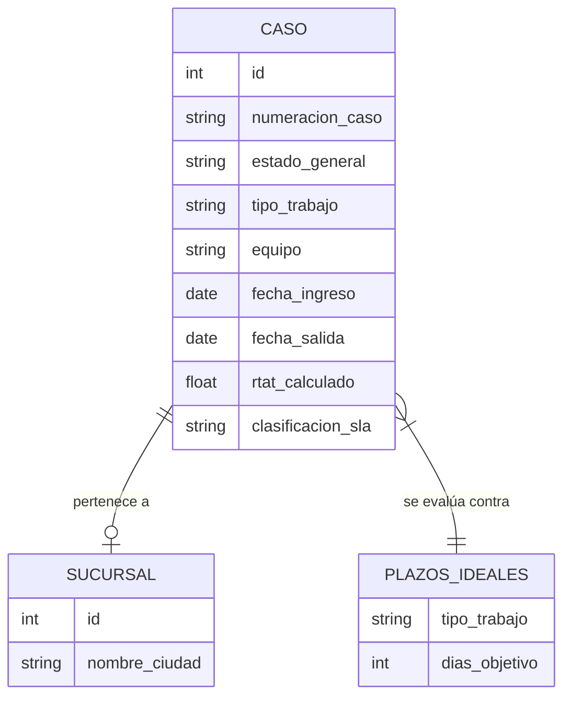

# Análisis Detallado del Módulo de Estadísticas

Este documento describe el funcionamiento, la estructura de datos, las relaciones y las visualizaciones del módulo de estadísticas del Sistema de Garantías 2.0.

## 1. Arquitectura de Datos y Origen

El módulo se alimenta principalmente de la tabla `casos` en la base de datos Supabase, la cual centraliza toda la información de las órdenes de servicio y garantías.

### Entidades Principales
- **Casos (`casos`)**: Registra cada orden de trabajo. Contiene fechas, estados, cliente, y detalles técnicos.
- **Sucursales (`sucursales`)**: Relacionada con los casos para identificar la ubicación física (ej. Lima, Huancayo, etc.).
- **Equipos (`equipo`)**: Clasificación del hardware involucrado (Dron, Generador, Control, Batería).

## 2. Variables y Metas (SLA)

El sistema evalúa el desempeño basándose en el **RTAT (Response Turnaround Time)**, que representa el tiempo de respuesta en días hábiles.

### Cálculo de RTAT
- Se calculan **días hábiles** (excluyendo domingos y feriados) entre la `fecha_ingreso` y la `fecha_salida`.
- Si el caso está **ABIERTO**, se usa la fecha actual como referencia para medir el tiempo transcurrido.

### Clasificación de Eficiencia (SLA)
La clasificación se basa en "Plazos Ideales" predefinidos por tipo de trabajo:

| Tipo de Trabajo | Plazo Ideal (Días) |
| :--- | :---: |
| REPARACION ELECTRONICA / MECANICA / RC / BATERIA | 5 |
| REPARACION GENERADOR / CASO CRASH / COMPLEJA | 10 |
| ACTIVACION | 1 |

**Buckets de SLA:**
- **A TIEMPO**: RTAT ≤ Plazo Ideal.
- **APLAZADO**: Plazo Ideal < RTAT ≤ (2 × Plazo Ideal).
- **ATRASADO**: RTAT > (2 × Plazo Ideal).

## 3. Visualizaciones y Dashboards

El dashboard se divide en secciones lógicas para ofrecer una visión 360° de la operación:

### A. Indicadores Clave (KPI Cards)
- **Total Casos**: Recuento total según los filtros aplicados.
- **Casos Abiertos**: Volumen de trabajo pendiente.
- **Casos Cerrados**: Productividad total del periodo.
- **% Abiertos**: Relación entre carga de trabajo y capacidad de cierre.

### B. Análisis de Distribución y Eficiencia
- **Dona de Distribución**: Muestra qué sucursales concentran la mayor cantidad de casos.
- **Dona de Eficiencia SLA**: Resumen visual de cuántos casos se cerraron "A Tiempo", "Aplazados" o "Atrasados".

### C. Evolución y Comparativa
- **Semaforización por Evolución**: Un gráfico de líneas/áreas que muestra cómo ha variado el % de cumplimiento SLA mes a mes.
- **Semaforización por Sucursal**: Compara el rendimiento de todas las ciudades para identificar cuellos de botella geográficos.

### D. Análisis de Demoras (RTAT)
- **Barras de Desviación**: Compara el **RTAT Promedio Real** vs el **Plazo Ideal**. Permite ver qué tipos de trabajo suelen exceder el tiempo esperado.
- **Demora Promedio por Sucursal**: Divide la demora promedio de cada ciudad diferenciando entre casos **Con Garantía** y **Sin Garantía**.
- **Histograma RTAT**: Muestra la frecuencia con la que ocurren las demoras (ej. cuántos casos tardan entre 0-5 días, 5-10 días, etc.).

### E. Mapas de Calor (Heatmaps)
Visualizaciones avanzadas que cruzan datos para detectar patrones de incumplimiento:
- **Periodo vs Sucursal**: Identifica si un mes específico hubo problemas en una ciudad concreta.
- **Tipo de Trabajo vs Sucursal**: Revela si una sucursal tiene dificultades técnicas con un equipo específico (ej. "Lima tarda mucho en Reparación de Generadores").

## 4. Sistema de Filtrado Global

La potencia del módulo reside en sus filtros cruzados, que permiten segmentar toda la información anterior por:
1. **Estado General**: Todos, Abiertos, Cerrados o Devueltos.
2. **Sucursal**: Filtrar datos de una ubicación específica.
3. **Tipo de Garantía**: Con o Sin Garantía.
4. **Periodo**: Selección múltiple de meses (ej. comparar T1 contra T2).
5. **Equipo**: Segmentación por Dron, Generador, etc.
6. **Tipo de Trabajo**: Análisis específico de reparaciones vs activaciones.
7. **Estado Interno**: Filtro por estados específicos del flujo de trabajo (ej. "En Espera de Repuestos").

## 5. Relaciones de Datos

El flujo lógico es: 
1. El **Caso** se ingresa con fechas.
2. El sistema calcula el **RTAT** en días hábiles.
3. Se busca el **Plazo Ideal** correspondiente al `tipo_trabajo`.
4. Se asigna la **Clasificacion SLA**.
5. Los gráficos agrupan estos resultados por **Sucursal**, **Periodo** y **Equipo**.
